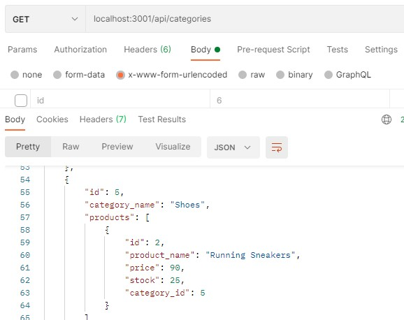

# E-Commerce Back End

  ## Description
The aim of this project is to create the back end side of an e-commerce website where users can easily manage the products in their store. The application allows the user to view their products by the category, individual product or the tag of the product. It also allows the user to add, delete and update their products. To view a walkthrough video explaining how this application works, please click [here](https://drive.google.com/file/d/1myrCSOmU_rjsyf5U-hxus7S2h8Dv8xcB/view). 

## Table of Contents 

* [Installation](#installation)
* [Usage](#usage)
* [License](#License)
* [Contributing](#contributing)
* [Test](#test)
* [Questions](#questions)

## Installation
The technologies used for this project include The tools and technologies used in this project were JavaScript, npm express package, sequelize and MySQL2. The dotenv package was used to keep sensitive data safe and Postman was also used to test the functionality of the application. . To use this application, Node.js and the npm packages for express, MySQL2, sequelize and dotenv will need to be installed. The database will need to be created in a MySQL workspace and the database will need to be seeded using the command "npm run seed". To start the application, simply run the command "npm start".  

## Usage
The following is a screenshot of the application being tested in Postman. This is an example of how the GET route for categories gets all of the categories in the database and displays them in JSON format. 

## License 
Permission is hereby granted, free of charge, to any person obtaining a copy of this software and associated documentation files(the "Software"), to deal in the Software without restriction, including without limitation the rights to use, copy, modify, merge, publish, distribute, sublicense, and / or sell copies of the Software, and to permit persons to whom the Software is furnished to do so, subject to the following conditions: The above copyright notice and this permission notice shall be included in all copies or substantial portions of the Software. THE SOFTWARE IS PROVIDED "AS IS", WITHOUT WARRANTY OF ANY KIND, EXPRESS OR IMPLIED, INCLUDING BUT NOT LIMITED TO THE WARRANTIES OF MERCHANTABILITY, FITNESS FOR A PARTICULAR PURPOSE AND NONINFRINGEMENT.IN NO EVENT SHALL THE AUTHORS OR COPYRIGHT HOLDERS BE LIABLE FOR ANY CLAIM, DAMAGES OR OTHER LIABILITY, WHETHER IN AN ACTION OF CONTRACT, TORT OR OTHERWISE, ARISING FROM, OUT OF OR IN CONNECTION WITH THE SOFTWARE OR THE USE OR OTHER DEALINGS IN THE SOFTWARE.

## Contributing
NA

## Test
Test the application using Postman or another program such as Insomnia. 

## Questions
If you have any questions or would like further information on this project, 
please contact silviataliana2@gmail.com or find me on [Github](https://github.com/silvia-taliana).
